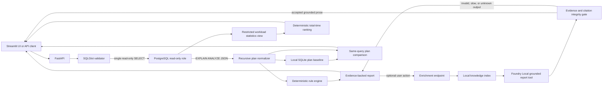
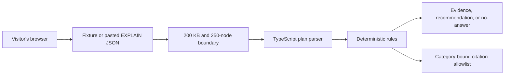

# QueryPilot Local architecture

QueryPilot Local has two deliberately separate surfaces:

1. **Local engineering runtime** — executes a validated read-only query against
   the synthetic PostgreSQL database, analyzes the real JSON execution plan,
   and can optionally enrich the deterministic report with local retrieval and
   evidence-grounded natural-language generation.
2. **Public portfolio demo** — accepts only synthetic fixtures or pasted
   `EXPLAIN (FORMAT JSON)` output and runs the deterministic analyzer entirely
   in the browser.

The separation keeps the public deployment database-free while preserving a
full local implementation for technical demonstrations.

## Local engineering runtime

### Primary analysis path

`POST /api/v1/analyses` performs the correctness-critical work:

- parses the SQL AST and accepts one `SELECT` or `WITH ... SELECT` statement;
- rejects data-changing statements, `SELECT INTO`, row locks, and known
  side-effect functions;
- runs PostgreSQL in a read-only transaction with a three-second statement
  timeout;
- recursively normalizes `EXPLAIN (ANALYZE, BUFFERS, FORMAT JSON)`;
- detects four MVP issue categories with deterministic rules;
- returns plan evidence, severity, recommendation SQL, and no-answer state
  without waiting for a language model.

The current categories are potential missing index, expensive nested loop,
disk-based sort, and cardinality misestimation. If no rule has sufficient
evidence, the result is explicitly `no_clear_issue`; QueryPilot does not invent
an optimization.

### Workload prioritization

`GET /api/v1/workload/queries` reads a restricted projection over
`pg_stat_statements` and ranks eligible SELECT statements by total execution
time. The application role cannot read the extension view directly. The
projection exposes only the normalized query, call and timing counters, result
rows, and selected block counters.

This endpoint produces prioritization evidence, not an optimization finding.
It never executes a captured statement and never returns recommendation SQL.
Statements normalized to `$1`, `$2`, and similar placeholders are marked as
requiring representative SQL before the existing analysis endpoint may be used.
The live synthetic smoke result confirmed that the repeated `orders` scan ranked
above a more frequently called primary-key lookup and that the application role
could access only the restricted projection.

### Plan baseline and regression comparison

One to nine analyzed plans can be saved to a local SQLite baseline store. All
samples must have the same normalized SQL fingerprint and plan structure. The
stored record contains median execution and planning time, median node metrics,
root cost, sample count, and node identity.

A comparison is accepted only for the same normalized SQL fingerprint. The
deterministic comparator reports:

- execution-time absolute and percentage change;
- root-cost absolute and percentage change;
- node-count and structural changes;
- index name changes; and
- index-backed access degrading to a sequential scan.

Timing alerts require both a configurable ratio and an absolute millisecond
increase, which prevents very small fixture noise from becoming a regression
claim. Cost and access-path thresholds are independent evidence. The
comparison returns `recommendations_generated=false`; it never executes a
captured query or applies a change.

If PostgreSQL selects different plan structures across samples, aggregation is
rejected instead of hiding the instability inside an average. The local store
keeps a configurable maximum number of recent baselines and supports explicit
deletion.

### Optional enrichment path

`POST /api/v1/analyses/{analysis_id}/enrichment` is intentionally outside the
primary path:

- retrieves category-supporting chunks from six local PostgreSQL documents;
- exposes citations only from the application-owned category allowlist;
- supplies the retrieved chunk text and deterministic plan evidence to the
  local chat model;
- asks the model to generate a concise summary and recommendation through a
  four-field Foundry tool call;
- rejects unknown evidence/citation IDs, invented numbers, SQL-like change
  instructions, untrusted URLs, extra fields, and malformed output;
- attempts repair only when the first invalid response finishes within the
  configured cutoff, otherwise returning the deterministic fallback directly.

The language model writes the human-facing prose, but cannot change category,
severity, recommendation SQL, raw plan evidence, or no-answer state. Citations
are assembled from the exact retrieved chunk IDs accepted by the validator.

## Public demo runtime

The public demo has no PostgreSQL connection, API request for analysis, model
inference, embedding call, or application-owned persistence. Pasted plan
content stays in the browser. Citation-like fields inside input JSON are
ignored.

## Trust boundaries

| Boundary | Control |
| --- | --- |
| Submitted SQL | AST validation plus one-statement, read-only policy |
| PostgreSQL | `SELECT`-only role, read-only transaction, statement timeout |
| Workload statistics | Security-definer projection, SELECT/WITH filter, deterministic total-time ranking |
| Non-production pilot | Explicit authorization, exact database match, non-privileged read-only role, query allowlist, dual opt-in for execution |
| Plan baseline | Local SQLite record keyed by normalized-SQL fingerprint |
| Regression alert | Deterministic timing, cost, and access-path evidence; no recommendation |
| Recommendation | Display-only SQL; never applied automatically |
| Plan evidence | Derived from normalized plan nodes, never from the model |
| Retrieval | Local index and known document IDs |
| Model response | Generated prose bound to known evidence and retrieved chunk IDs |
| Citations | Application-owned, category-specific allowlist |
| Public input | JSON only, 200 KB, at most 250 plan nodes |

## Current measured result

On the committed 12-scenario fixture set:

- rule diagnosis accuracy: 12/12;
- no-answer accuracy: 12/12;
- retrieval Hit@3: 9/9 applicable cases;
- valid response citations: 4/4 generation samples;
- `qwen2.5-1.5b` accepted grounded generations: 4/4;
- average optional generation latency on CPU: 48,256 ms;
- generation p95 latency on CPU: 55,668 ms.

The committed synthetic missing-index benchmark uses seven repetitions. Its
latest observed medians were 1.671 ms for the sequential scan and 0.074 ms for
the index scan. PostgreSQL named `idx_customers_email` in the after plan. The
benchmark restores the default fixture without the index when it finishes.

These are MVP fixture results, not production workload claims. The local model
is optional because its CPU latency is unsuitable for the primary response
path. The observed plan timing is also a local fixture result, not a production
performance guarantee.

## Deployment map

- Full local runtime: Windows, Docker Desktop PostgreSQL, FastAPI, Streamlit,
  and optional Foundry Local.
- Public demo: static/browser-first deployment at
  `https://querypilot.eraykulkizaga.com`.
- Custom domain and TLS terminate at the public hosting provider; no private
  database or local model is exposed.
