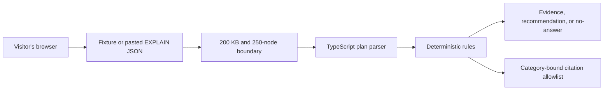

# QueryPilot Local architecture

QueryPilot Local has two deliberately separate surfaces:

1. **Local engineering runtime** — executes a validated read-only query against
   the synthetic PostgreSQL database, analyzes the real JSON execution plan,
   and can optionally enrich the deterministic report with local retrieval and
   sentence selection.
2. **Public portfolio demo** — accepts only synthetic fixtures or pasted
   `EXPLAIN (FORMAT JSON)` output and runs the deterministic analyzer entirely
   in the browser.

The separation keeps the public deployment database-free while preserving a
full local implementation for technical demonstrations.

## Local engineering runtime

```mermaid
flowchart LR
    U["Streamlit UI or API client"] --> A["FastAPI"]
    A --> V["SQLGlot validator"]
    V -->|single read-only SELECT| P["PostgreSQL read-only role"]
    P -->|EXPLAIN ANALYZE JSON| N["Recursive plan normalizer"]
    N --> R["Deterministic rule engine"]
    R --> D["Evidence-backed report"]
    D --> U

    D -->|optional user action| E["Enrichment endpoint"]
    E --> K["Local knowledge index"]
    K --> F["Foundry Local sentence selector"]
    F --> G["Strict schema and allowlist gate"]
    G -->|accepted sentence IDs only| U
    G -->|invalid, slow, or unknown output| D
```

### Primary analysis path

`POST /api/v1/analyses` performs the correctness-critical work:

- parses the SQL AST and accepts one `SELECT` or `WITH ... SELECT` statement;
- rejects data-changing statements, `SELECT INTO`, row locks, and known
  side-effect functions;
- runs PostgreSQL in a read-only transaction with a three-second statement
  timeout;
- recursively normalizes `EXPLAIN (ANALYZE, BUFFERS, FORMAT JSON)`;
- detects four MVP issue categories with deterministic rules;
- returns plan evidence, severity, recommendation SQL, and no-answer state
  without waiting for a language model.

The current categories are potential missing index, expensive nested loop,
disk-based sort, and cardinality misestimation. If no rule has sufficient
evidence, the result is explicitly `no_clear_issue`; QueryPilot does not invent
an optimization.

### Optional enrichment path

`POST /api/v1/analyses/{analysis_id}/enrichment` is intentionally outside the
primary path:

- retrieves category-supporting chunks from six local PostgreSQL documents;
- exposes citations only from the application-owned category allowlist;
- asks the local chat model to select two application-authored sentence IDs;
- rejects unknown IDs, extra fields, malformed JSON, model-authored prose, and
  unsupported citations;
- attempts repair only when the first invalid response finishes within the
  configured cutoff, otherwise returning the deterministic fallback directly.

The language model cannot create technical facts, recommendation SQL, evidence,
or citations. It can only choose among sentences already approved by the
application.

## Public demo runtime

The public demo has no PostgreSQL connection, API request for analysis, model
inference, embedding call, or application-owned persistence. Pasted plan
content stays in the browser. Citation-like fields inside input JSON are
ignored.

## Trust boundaries

| Boundary | Control |
| --- | --- |
| Submitted SQL | AST validation plus one-statement, read-only policy |
| PostgreSQL | `SELECT`-only role, read-only transaction, statement timeout |
| Recommendation | Display-only SQL; never applied automatically |
| Plan evidence | Derived from normalized plan nodes, never from the model |
| Retrieval | Local index and known document IDs |
| Model response | Two allowlisted sentence IDs under a strict schema |
| Citations | Application-owned, category-specific allowlist |
| Public input | JSON only, 200 KB, at most 250 plan nodes |

## Current measured result

On the committed 12-scenario fixture set:

- rule diagnosis accuracy: 12/12;
- no-answer accuracy: 12/12;
- retrieval Hit@3: 9/9 applicable cases;
- valid response citations: 4/4 generation samples;
- `qwen2.5-1.5b` accepted sentence selections: 4/4;
- average optional selection latency on CPU: 20,243 ms.

These are MVP fixture results, not production workload claims. The local model
is optional because its CPU latency is unsuitable for the primary response
path.

## Deployment map

- Full local runtime: Windows, Docker Desktop PostgreSQL, FastAPI, Streamlit,
  and optional Foundry Local.
- Public demo: static/browser-first deployment at
  `https://querypilot.eraykulkizaga.com`.
- Custom domain and TLS terminate at the public hosting provider; no private
  database or local model is exposed.
